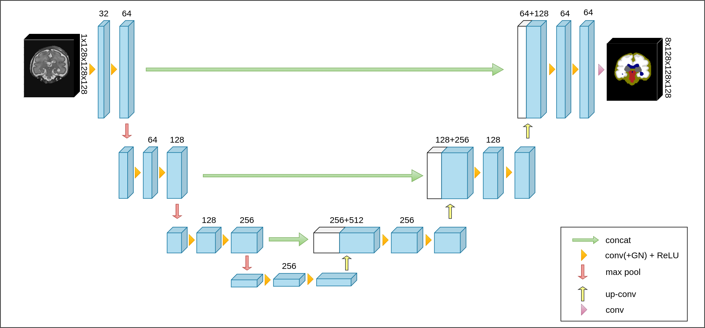
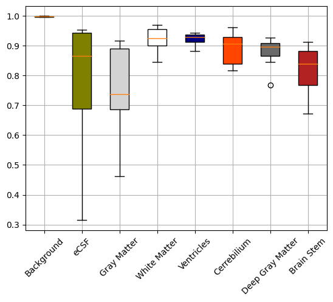

# 3D (Volumetric) Medical Image Segmentation with Deep Learning
This GitHub repository was created as a part of my master's thesis project for research focusing on the development of deep learning-based segmentation models for fetal brain tissue. It serves as a guiding example for executing a small-scale research project, providing insights into data processing, training, evaluation, and systematic experiment storage.

Project Organization
------------

    ├── LICENSE
    ├── README.md          <- The top-level README for developers using this project.
    ├── .env               <- Jupyter notebook token for authentication.
    ├── compose-devenv.yml <- Configuration of development environment services.
    ├── data
    │   ├── external       <- Data from third party sources.
    │   ├── interim        <- Intermediate data that has been transformed.
    │   ├── processed      <- The final, canonical data sets for modeling.
    │   └── raw            <- The original, immutable data dump.
    │
    ├── dev_env            <- Files required to start the development environment in Windows. 
    │
    ├── models             <- Trained and serialized models, model predictions, or model summaries
    │
    ├── notebooks          <- Jupyter notebooks.
    │
    ├── references         <- Data dictionaries, manuals, and all other explanatory materials.
    │
    ├── reports            <- Generated analysis as HTML, PDF, LaTeX, etc.
    │   └── figures        <- Generated graphics and figures to be used in reporting
    │
    ├── requirements.txt   <- The requirements file for reproducing the analysis environment, e.g.
    │                         generated with `pip freeze > requirements.txt`
    │
    ├── src                <- Source code for use in this project.
    │   ├── __init__.py    <- Makes src a Python module
    │   │
    │   ├── data           <- Scripts to download, generate or transform data
    │   │   └── transforms
    │   │   └── Dataset.py
    │   │
    │   ├── features       <- Scripts to turn raw data into features for modeling
    │   │   └── build_features.py
    │   │
    │   ├── models         <- Scripts to train models and then use trained models to make
    │   │   │                 predictions
    │   │   └── models
    │   │   └── Evaluator.py
    │   │   └── Predictor.py
    │   │   └── Trainer.py
    │   │
    │   ├── utils  <- Scripts to load configuration parameters from yaml files and to use common rutines of the project
    │   │   └── Config.py
    │   │   └── LossFunctions.py
    │   │   └── Utils.py
    │   │
    │   └── visualization  <- Scripts to create exploratory and results oriented visualizations
    │       └── Tensorboard.py
    │       └── Visualization.py

--------

## Development Environment

For an efficient and organized development process, it is recommended utilizing Docker. This practice isolates project-specific dependencies, ensuring a clean and organized development environment. Follow these steps to set up your Docker environment and integrate your `src` folder:

**Prerequisites:**
- Docker version 20.10.17, build 100c701

**Getting Started with the Development Environment:**
1. **Initialization:** Open your command line within the project folder and execute the following command. This will initiate Jupyter Notebook, Tensorboard, and SSH services: \
  `docker-compose -f compose-devenv.yml up --build`
2. **Accessing the Services:** Access Jupyter Notebook and Tensorboard via the following URLs:
   - Jupyter Notebook: `http://<hostadress>:8888/`\
     **Note:** Codefolding, Collapsible Headings, and other options can be enabled in the Nbextensions tab.
   - Tensorboard: `http://<hostadress>:6006/`
3. **Security Note:** Default token for the Jupyter Notebook is in the [.env](.env) file. For security, please update the [token](.env).
4. **Remote Configuration** For more detailed information on setting up a remote development environment, refer to documentation [here](dev_env/). 

## Project Information

### 1. Data

  Dataset obtained from FeTA2021 Grand Challenge. Dataset consist of 80 subject of fetuses from 21 to 33 weeks. Images and masks are in the NIfTI format. 
  Dimensions of the raw MRIs are 256x256x256. There are 8 class which includes background label.
["The dataset facilitates the development of novel machine-learning and deep-learning based multi-class segmentation methods for the quantification of brain development on fetal MRI. The ultimate goal is to capture pathological developmental trajectories by the automated quantification of the prenatal development, for which automated approaches free of observer bias are indispensable."](http://neuroimaging.ch/feta) Some brief information about the labels can be found below. For more information, please follow the links in the notes.

| dHCP label | Name | Notes |
| :- | -: | :-: |
| Label 1 | Intracranial space and extra-axial CSF spaces | Cerebrospinal fluid (CSF) is a clear, colorless body fluid found within the tissue that surrounds the brain and spinal cord of all vertebrates.[[1]](https://en.wikipedia.org/wiki/Cerebrospinal_fluid) 
| Label 2 | Gray Matter | Grey matter (or gray matter) is a major component of the central nervous system, consisting of neuronal cell bodies, neuropil (dendrites and unmyelinated axons), glial cells (astrocytes and oligodendrocytes), synapses, and capillaries.[[2]](https://en.wikipedia.org/wiki/Grey_matter) 
| Label 3 | White Matter | White matter refers to areas of the central nervous system (CNS) that are mainly made up of myelinated axons, also called tracts. [[3]](https://en.wikipedia.org/wiki/White_matter)
| Label 4 | Ventricles | The ventricles are structures that produce cerebrospinal fluid, and transport it around the cranial cavity. [[4]](https://teachmeanatomy.info/neuroanatomy/vessels/ventricles/)
| Label 5 | Cerebellum | The cerebellum (which is Latin for “little brain”) is a major structure of the hindbrain that is located near the brainstem. This part of the brain is responsible for coordinating voluntary movements. It is also responsible for a number of functions including motor skills such as balance, coordination, and posture. [[5]](https://www.verywellmind.com/what-is-the-cerebellum-2794964)
| Label 6 | Deep gray matter | Grey matter is classed as either superficial or deep. The superficial grey matter, also called brain cortex, is on the outside of the brain. The deep grey matter is made up of neurons from which originate deep nerve fibres. These neurons tend to form clumps of basal nuclei.[[6]](https://www.msif.org/news/2014/12/16/role-deep-grey-matter-brain-plays-ms/)
| Label 7 | Brainstem and spinal cord| The brainstem (or brain stem) is the posterior stalk-like part of the brain that connects the cerebrum with the spinal cord. [[7]](https://en.wikipedia.org/wiki/Brainstem)

  

  

Figure 1. Brain tissues. <a href="https://www.researchgate.net/profile/Ching-Cheng-Chuang/publication/224283818/figure/fig1/AS:213943978074118@1428019627889/Three-dimensional-in-vivo-MRI-T1-brain-image-In-the-simulation-the-three-dimensional.png"> Reference</a>

  
### 2. Models
Models have been implemented for the research. 
 

    
    
Figure 2. 3D U-Net Architecture

 

    
    
Figure 3. 3D SDU-Net (Stacked Dilated U-Net) A new 3D Segmentation model based on <a href="https://doi.org/10.1016/j.compbiomed.2022.105891">SDU-Net</a> was developed for this research.

### 3. Results
Results of models trained and tested on the FeTA2021 dataset.
 
#### 3.1. Whisker-Box Plots

    
    
    
Figure 4. Whisker-Box plot (left) and Confusion Matrix (right) of 3D U-Net model.

 

    
    
    
Figure 5. Whisker-Box plot (left) and Confusion Matrix (right) of 3D SDU-Net model.

#### 3.2. Segmentation Outputs

    
    
    
Figure 6. Segmentation outputs of 3D U-Net (left) and 3D SDU-Net (right) models for same fetal subject.

   

<small>Project based on the <a target="_blank" href="https://drivendata.github.io/cookiecutter-data-science/">cookiecutter data science project template</a>. #cookiecutterdatascience</small>

