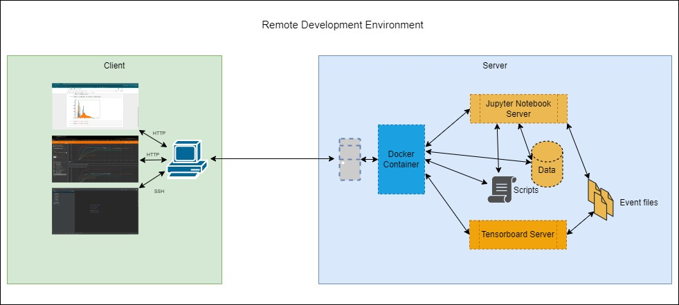

## Development Environment

  

The experimentation phase was carried out within two distinct environments: Linux Mint and Windows 11. Linux Mint was utilized as the client-side environment, while Windows 11 served as the server-side environment. The hardware and software specifications for the server-side setup were as follows:

**Hardware:**
- Intel(R) Core(TM) i5-4670K CPU @ 3.40 GHz
- 32 GB RAM
- 11 GB NVIDIA GeForce GTX 1080 Ti

**Software:**
- CUDA Version: 11.2
- cuDNN Version: 8.1.1

---

Python modules for evaluation, training, and visualization were implemented using PyCharm, whereas Jupyter Notebook facilitated the execution of evaluation and training processes. TensorBoard was used for real-time monitoring and analysis of training progress.

Jupyter Notebook, TensorBoard, and SSH services have been launched using Docker. Jupyter Notebook and Tensorboard can be accessible via Web Browser. However, to utilize a remote interpreter and project directory, it's essential to configure a PyCharm remote connection for SSH and SFTP.
For detailed instructions on setting up PyCharm remote development, please refer to this guide: [PyCharm Remote Development Guide](https://medium.com/@erikhallstrm/work-remotely-with-pycharm-tensorflow-and-ssh-c60564be862d)

---
### Recommended Configuration
**Security Note:** For security, please update the following line in your [Dockerfile](Dockerfile.devenv) to set a secure password for the 'dev' user and don't forget to change 'token' of Jupyter Notebook in the [.env](../.env) file:\
`RUN useradd -ms /bin/bash dev && echo 'dev:<your-secure-password>' | chpasswd`

**Deployment Configuration:**\
It is recommended to set up deployment configuration as follows:
- Root path: `/home/dev/3D-Volumetric-MedicalImageSegmentationWithDeepLearning`
- Deployment path: `/`

**SSH Configuration:**\
To complete setup, configure your SSH settings as follows:
- Host: `remotehost`
- Port: `7776`
- Username: `dev`
- Password: `<your-secure-password>`
